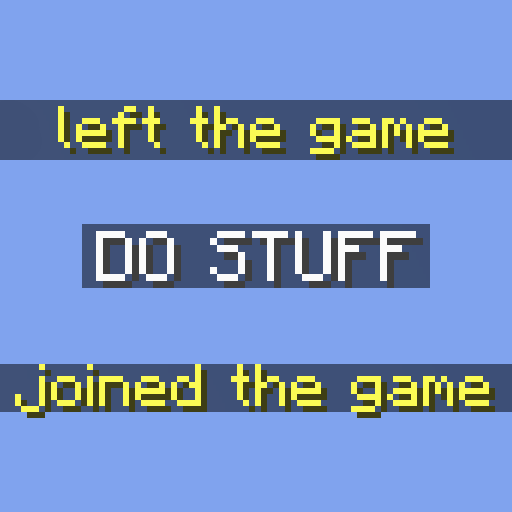

<!--suppress HtmlDeprecatedAttribute HtmlDeprecatedTag, XmlDeprecatedElement -->
<div align="center"><center>

<!--suppress CheckImageSize -->


## WhileEmpty

Allows configuring commands to be run on a server when the last player leaves and when the first
player joins.

[![Environment](https://img.shields.io/badge/Environment-Client-blue?logo=data:image/png;base64,iVBORw0KGgoAAAANSUhEUgAAAEAAAABACAYAAACqaXHeAAABhWlDQ1BJQ0MgcHJvZmlsZQAAKJF9kT1Iw0AYht+malUqDnYQEclQneyiIo6likWwUNoKrTqYXPoHTRqSFBdHwbXg4M9i1cHFWVcHV0EQ/AFxdnBSdJESv0sKLWI8uLuH97735e47QGhUmGp2RQFVs4xUPCZmc6ti4BU9CKCP1jGJmXoivZiB5/i6h4/vdxGe5V335xhQ8iYDfCJxlOmGRbxBPLtp6Zz3iUOsJCnE58STBl2Q+JHrsstvnIsOCzwzZGRS88QhYrHYwXIHs5KhEs8QhxVVo3wh67LCeYuzWqmx1j35C4N5bSXNdZqjiGMJCSQhQkYNZVRgIUK7RoqJFJ3HPPwjjj9JLplcZTByLKAKFZLjB/+D3701C9NTblIwBnS/2PbHOBDYBZp12/4+tu3mCeB/Bq60tr/aAOY+Sa+3tfARMLgNXFy3NXkPuNwBhp90yZAcyU9TKBSA9zP6phwwdAv0r7l9a53j9AHIUK+Wb4CDQ2CiSNnrHu/u7ezbvzWt/v0ATphymIBZ6aQAAAAGYktHRAAKAAwAGd6C8noAAAAJcEhZcwAADdcAAA3XAUIom3gAAAAHdElNRQfoBgcOHRYlcgoRAAABRklEQVR42u2YMUoDQRRAX0axUzCteIZ4hKn0FDmFhalSWKkgnkHt9AQWwhzBNr2tBGNno82ACwm6EZvxvwdTzP8s7P8zu8w8EJHIDABKKfvAFXAIbP/zmt+AR2CSc54NavFPwDDY4s+BUaorPwy4+3eBy1S3fVSOUoBv/jt2UmMv/A6cAHt1TGqsb36JzcYaMM05X3Tm56UUgLOe+SVa2wE3K2LXa+Sbb8BgRWxjjXzzDRj/EBv3fOarY6WUj8Z+glPgtlPcKbDVM998A/6cVM/GUXlN9WIQlYdUDwvzgMW/AMcp5zwDRsA9sAhQ+AK4Aw5yzs8aEZHY6AR1gjpBnaBOsLHrsE6wM9cJohPUCeoE0Qn+Hp0gOkGdoE5QRMKiE9QJ6gR1gjrBxq7DOsHOXCeITlAnqBNEJ/h7dILoBHWCOkERCcsncuextWq5TzoAAAAASUVORK5CYII=)]()
[](https://fabricmc.net)
[](https://github.com/TerminalMC/WhileEmpty)

</center></div>

### About

- The mod can be configured via the `whileempty.json` config file.

```json
{
  "options": {
    // the mod status
    "enabled": true,
    // the player-count at which the server is considered 'empty'
    "emptyThreshold": 0,
    // a list of delayed messages or commands to be run when the playercount reaches the threshold (descending)
    "onLastPlayerLeave": [
      {
        "message": "Server is now empty!",
        "delayTicks": 20
      },
      {
        "message": "/say Server has now been empty for 2 seconds!",
        "delayTicks": 40
      }
    ],
    // a list of delayed messages or commands to be run when the playercount exceeds the threshold (ascending)
    "onFirstPlayerJoin": [
      {
        "message": "Server is no longer empty!",
        "delayTicks": 0
      }
    ]
  }
}
```

- The following commands are available under the `/whileempty` prefix:
  - `enable`
    - Enables the mod
  - `disable`
    - Disables the mod
  - `reload`
    - Reloads the configuration (use this after editing the `whileempty.json` config file)
  - `reset`
    - Reset the configuration to default.

### Contact

[](https://discord.terminalmc.dev)

[](https://github.com/TerminalMC/WhileEmpty/issues)

[](https://github.com/TerminalMC/WhileEmpty/blob/HEAD/LICENSE.txt)
